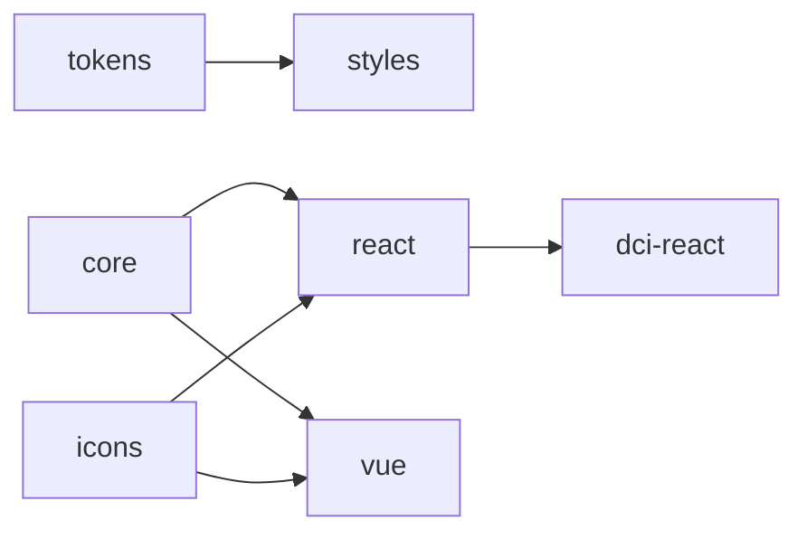

# Искра.DCI Design System

Монорепозиторий дизайн-системы **Искра.DCI** — UI-библиотеки для платформы управления инфраструктурой центров обработки данных (_Data Center Interface_). Пакеты `@iskra-ui/*` поставляют токены, стили, иконки, headless-логику и компоненты для **React** и **Vue 3**.

Стиль системы — **Hard-Shell Minimal**: тёмный индустриальный интерфейс, один акцентный оттенок, информационная плотность. Принципы дизайна и контента — в [docs/FOUNDATIONS.md](docs/FOUNDATIONS.md).

---

## Пакеты

| Пакет                                                       | Назначение                                                                   |
| ----------------------------------------------------------- | ---------------------------------------------------------------------------- |
| [`@iskra-ui/tokens`](docs/PACKAGES.md#iskra-uitokens)       | DTCG-токены → CSS-переменные + TypeScript                                    |
| [`@iskra-ui/styles`](docs/PACKAGES.md#iskra-uistyles)       | Глобальные стили, шрифты, reset                                              |
| [`@iskra-ui/icons`](docs/PACKAGES.md#iskra-uiicons)         | Иконки 16×16, stroke 1.5px                                                   |
| [`@iskra-ui/core`](docs/PACKAGES.md#iskra-uicore)           | Headless-логика (React + Vue)                                                |
| [`@iskra-ui/react`](docs/PACKAGES.md#iskra-uireact)         | React-компоненты                                                             |
| [`@iskra-ui/vue`](docs/PACKAGES.md#iskra-uivue)             | Vue 3-компоненты                                                             |
| [`@iskra-ui/dci-react`](docs/PACKAGES.md#iskra-uidci-react) | Доменные компоненты: DeviceCard, FleetPulse, CliRow, DriftToast, ApiKeyModal |

Подробное описание каждого пакета — в [docs/PACKAGES.md](docs/PACKAGES.md).

### Архитектура зависимостей



---

## Быстрый старт

### Установка

```bash
pnpm add @iskra-ui/react @iskra-ui/styles
```

Опционально: `@iskra-ui/vue`, `@iskra-ui/dci-react`.

### Подключение (React)

```ts
import '@iskra-ui/styles/index.css';
import '@iskra-ui/react/styles.css';
import { Button, TextField, Badge, Icon } from '@iskra-ui/react';
```

```tsx
<TextField label="Хост" iconBefore={<Icon name="search" />} clearable />
<Button variant="outline" iconBefore={<Icon name="refresh" />}>Force Sync</Button>
<Badge variant="warning" dot>Drift</Badge>
```

Примеры для Vue и доменных компонентов — в [docs/PACKAGES.md](docs/PACKAGES.md).

### Темы

По умолчанию — тёмная тема (`:root`). Светлые темы — классы на `<body>`:

- `theme-cold` — холодная off-white
- `theme-warm` — тёплый sand

White-label: `brand-aurora` (и другие бренды в `packages/tokens/src/brands/`). Подробнее — в [docs/PACKAGES.md](docs/PACKAGES.md#темы-и-white-label).

---

## Разработка в монорепозитории

**Требования:** Node ≥22, pnpm 11.7 (Corepack).

```bash
pnpm install
pnpm build
pnpm storybook    # Storybook на localhost
pnpm test         # Vitest
```

Полное руководство для контрибьюторов — [CONTRIBUTING.md](CONTRIBUTING.md).

### Структура репозитория

```
packages/     # @iskra-ui/* — publishable-библиотеки
apps/         # docs-react — Storybook + visual tests
scripts/      # lint:tokens (token adherence)
docs/         # FOUNDATIONS.md, PACKAGES.md
```

---

## Документация

| Документ                                                                       | Содержание                                       |
| ------------------------------------------------------------------------------ | ------------------------------------------------ |
| [docs/FOUNDATIONS.md](docs/FOUNDATIONS.md)                                     | Продукт, контент, визуальные основы, иконография |
| [docs/PACKAGES.md](docs/PACKAGES.md)                                           | Пакеты, API, примеры                             |
| [CONTRIBUTING.md](CONTRIBUTING.md)                                             | CI, changesets, добавление компонентов           |
| [LICENCE.md](LICENCE.md)                                                       | Лицензии на код и сторонние компоненты           |
| [packages/react/COMPONENT_CHECKLIST.md](packages/react/COMPONENT_CHECKLIST.md) | Definition of Done для React-компонентов         |

**Storybook** — интерактивная документация компонентов и витрина токенов (Foundations): [iskra-dctech.github.io/iskra.ui-kit](https://iskra-dctech.github.io/iskra.ui-kit/) (публикуется при push в `master`) или локально: `pnpm storybook`.
