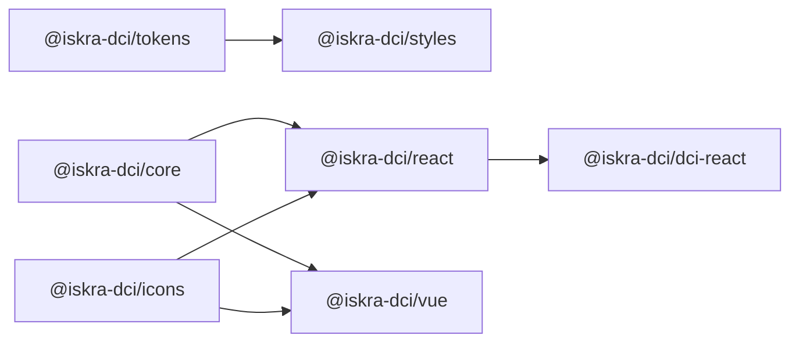

# Пакеты `@iskra-dci/*`

Описание publishable-пакетов монорепозитория. Все пакеты в scope `@iskra-dci`, версионируются через [Changesets](../CONTRIBUTING.md#версионирование-и-релизы).

## Схема зависимостей



---

## `@iskra-dci/tokens`

**Назначение:** DTCG design tokens → CSS-переменные, JSON и типизированная TS-карта (Style Dictionary).

**Entry points**

| Импорт                          | Содержимое               |
| ------------------------------- | ------------------------ |
| `@iskra-dci/tokens`             | TS API (`dist/index.js`) |
| `@iskra-dci/tokens/tokens.css`  | Только CSS-переменные    |
| `@iskra-dci/tokens/tokens.json` | Плоский JSON токенов     |
| `@iskra-dci/tokens/src/*`       | Исходники DTCG JSON      |

**Исходники:** `packages/tokens/src/` — `primitives/`, `semantic/`, `themes/` (cold, warm), `brands/` (например `aurora.json`).

**Зависимости:** нет runtime-зависимостей.

**Сборка**

```bash
pnpm --filter @iskra-dci/tokens build
```

**Пример**

```ts
import tokens from '@iskra-dci/tokens/tokens.json';
```

Обычно токены потребляются через `@iskra-dci/styles`, а не напрямую.

---

## `@iskra-dci/styles`

**Назначение:** глобальные стили — токены, self-hosted шрифты (Inter, JetBrains Mono), reset, element classes.

**Entry points**

| Импорт                           | Содержимое                   |
| -------------------------------- | ---------------------------- |
| `@iskra-dci/styles/index.css`    | Полный бандл (рекомендуется) |
| `@iskra-dci/styles/tokens.css`   | Только переменные            |
| `@iskra-dci/styles/fonts.css`    | `@font-face`                 |
| `@iskra-dci/styles/reset.css`    | Reset                        |
| `@iskra-dci/styles/elements.css` | Базовые element-классы       |

**Зависимости:** `@iskra-dci/tokens`.

**Сборка**

```bash
pnpm --filter @iskra-dci/styles build
```

**Пример**

```ts
import '@iskra-dci/styles/index.css';
```

Подключайте **один раз** в entry приложения, до компонентных стилей.

---

## `@iskra-dci/icons`

**Назначение:** framework-agnostic набор outline-иконок 16×16, stroke 1.5px.

**Entry point:** `@iskra-dci/icons`

**Экспорты:** `icons`, `iconNames`, `iconSvg()`, тип `IconName`.

**Зависимости:** нет.

**Сборка**

```bash
pnpm --filter @iskra-dci/icons build
```

**Пример**

```ts
import { iconSvg, type IconName } from '@iskra-dci/icons';

const svg = iconSvg('search', { size: 16 });
```

В React/Vue предпочтительнее компонент `Icon` из UI-библиотеки.

---

## `@iskra-dci/core`

**Назначение:** headless-логика, общая для React и Vue — state machines, ARIA helpers, keyboard, focus trap.

**Entry point:** `@iskra-dci/core`

**Основные экспорты:** `createId`, `Keys`, `isActivationKey`, `createTabsIds`, `disclosureReducer`, `createFocusTrap`, `getFocusable`, …

**Зависимости:** нет runtime-зависимостей.

**Сборка и тесты**

```bash
pnpm --filter @iskra-dci/core build
pnpm --filter @iskra-dci/core test
```

Обычно импортируется косвенно через `@iskra-dci/react` / `@iskra-dci/vue`. Прямой импорт — для кастомных компонентов поверх той же логики.

---

## `@iskra-dci/react`

**Назначение:** React 18+ UI-библиотека в стиле Hard-Shell Minimal. Классы `ik-*` сохранены с legacy-бандла.

**Entry points**

| Импорт                        | Содержимое             |
| ----------------------------- | ---------------------- |
| `@iskra-dci/react`            | Компоненты и утилиты   |
| `@iskra-dci/react/styles.css` | Стили всех компонентов |

**Peer dependencies:** `react`, `react-dom` ≥18.

**Зависимости:** `@iskra-dci/core`, `@iskra-dci/icons`.

**Сборка и тесты**

```bash
pnpm --filter @iskra-dci/react build
pnpm --filter @iskra-dci/react test
```

### Быстрый старт (React)

```bash
pnpm add @iskra-dci/react @iskra-dci/styles
```

```tsx
import '@iskra-dci/styles/index.css';
import '@iskra-dci/react/styles.css';
import { Button, TextField, Badge, Icon } from '@iskra-dci/react';

export function Example() {
  return (
    <>
      <TextField label="Хост" iconBefore={<Icon name="search" />} clearable />
      <Button variant="outline" iconBefore={<Icon name="refresh" />}>
        Force Sync
      </Button>
      <Badge variant="warning" dot>
        Drift
      </Badge>
    </>
  );
}
```

### Компоненты по категориям

| Категория   | Компоненты                                                                                                                                            |
| ----------- | ----------------------------------------------------------------------------------------------------------------------------------------------------- |
| Foundations | `Icon`                                                                                                                                                |
| Primitives  | `Button`, `IconButton`, `TextField`, `Textarea`, `Checkbox`, `Radio`, `RadioGroup`, `Switch`, `Badge`, `Tag`, `Avatar`, `Card`, `Skeleton`, `Spinner` |
| Patterns    | `FormField`, `Alert`, `EmptyState`, `Modal`, `Tabs`, `Table`, `Toast`, `Sidebar`                                                                      |
| Utilities   | `cx`                                                                                                                                                  |

Детали props, варианты и a11y — в Storybook (`pnpm storybook`) и JSDoc на компонентах.

**Размеры контролов:** `s` (28px) · `m` (32px) · `l` (36px).

**Sidebar:** общая навигация для operator/admin frontends. Props: `collapsed`, `onToggle`, `activeItem`, `onNavigate`, `variant`, `theme`, `badges`. ID пунктов: `overview`, `devices`, `topology`, `alerts`, `apikeys`, `log`, `settings`, `logout`; admin-only: `users`, `audit`, `system`.

---

## `@iskra-dci/vue`

**Назначение:** Vue 3.4+ компоненты с API-паритетом с React над общим `@iskra-dci/core` и теми же `ik-*` классами.

**Entry points**

| Импорт                      | Содержимое                                |
| --------------------------- | ----------------------------------------- |
| `@iskra-dci/vue`            | Vue SFC-компоненты                        |
| `@iskra-dci/vue/styles.css` | Re-export стилей React (`ik-*` идентичны) |

**Peer dependencies:** `vue` ≥3.4.

**Зависимости:** `@iskra-dci/core`, `@iskra-dci/icons`.

**Сборка и тесты**

```bash
pnpm --filter @iskra-dci/vue build
pnpm --filter @iskra-dci/vue test
```

### Быстрый старт (Vue)

```bash
pnpm add @iskra-dci/vue @iskra-dci/styles
```

```vue
<script setup lang="ts">
import '@iskra-dci/styles/index.css';
import '@iskra-dci/vue/styles.css';
import { Button, TextField, Badge } from '@iskra-dci/vue';
</script>

<template>
  <TextField label="Хост" />
  <Button variant="outline">Force Sync</Button>
  <Badge variant="warning" dot>Drift</Badge>
</template>
```

### Текущий набор компонентов

`Icon`, `Button`, `Badge`, `Spinner`, `Switch`, `Alert`, `Card`, `CardHeader`, `CardBody`, `CardFooter`, `TextField`, `Tabs`.

Остальные компоненты из React-пакета добавляются по мере достижения паритета. Следите за changelog пакета.

---

## `@iskra-dci/dci-react`

**Назначение:** доменные React-компоненты продукта Искра.DCI, построенные на `@iskra-dci/react`.

**Entry points**

| Импорт                            | Содержимое           |
| --------------------------------- | -------------------- |
| `@iskra-dci/dci-react`            | Доменные компоненты  |
| `@iskra-dci/dci-react/styles.css` | Дополнительные стили |

**Peer dependencies:** `react`, `react-dom` ≥18.

**Зависимости:** `@iskra-dci/react`, `@iskra-dci/core`, `@iskra-dci/icons`.

**Сборка и тесты**

```bash
pnpm --filter @iskra-dci/dci-react build
pnpm --filter @iskra-dci/dci-react test
```

### Компоненты

| Компонент     | Назначение                                  |
| ------------- | ------------------------------------------- |
| `DeviceCard`  | Карточка устройства в Inventory             |
| `FleetPulse`  | Сводка состояния флота (Fleet Intelligence) |
| `CliRow`      | Строка CLI/curl с копированием              |
| `DriftToast`  | Toast обнаруженного drift                   |
| `ApiKeyModal` | Модалка создания/управления API-ключами     |

### Пример

```bash
pnpm add @iskra-dci/dci-react @iskra-dci/react @iskra-dci/styles
```

```tsx
import '@iskra-dci/styles/index.css';
import '@iskra-dci/react/styles.css';
import '@iskra-dci/dci-react/styles.css';
import { DeviceCard, DriftToast } from '@iskra-dci/dci-react';

export function FleetView() {
  return (
    <>
      <DeviceCard
        name="leaf-07.msk"
        ip="10.0.2.7"
        status="drift"
        metricLabel="CPU · 24 ч"
        metricValue="88%"
        metricAlert
      />
      <DriftToast
        title="Drift обнаружен"
        description="leaf-07.msk расходится с Desired State"
        variant="drift"
      />
    </>
  );
}
```

---

## Приватные пакеты (не публикуются)

| Пакет                      | Назначение                       |
| -------------------------- | -------------------------------- |
| `@iskra-dci/eslint-config` | Общий ESLint flat config         |
| `@iskra-dci/tsconfig`      | Базовые `tsconfig` для библиотек |

---

## Темы и white-label

```html
<!-- Светлая холодная тема -->
<body class="theme-cold">
  <!-- Светлая тёплая тема -->
  <body class="theme-warm">
    <!-- White-label бренд поверх любой темы -->
    <body class="brand-aurora"></body>
  </body>
</body>
```

Новые бренды добавляются в `packages/tokens/src/brands/<name>.json` и пересобираются через `pnpm build:tokens`.

---

## См. также

- [FOUNDATIONS.md](./FOUNDATIONS.md) — дизайн и контент
- [MIGRATION.md](../MIGRATION.md) — миграция с `_ds_bundle.js`
- [CONTRIBUTING.md](../CONTRIBUTING.md) — разработка в монорепо
- [LICENCE.md](../LICENCE.md) — лицензии
- [COMPONENT_CHECKLIST.md](../packages/react/COMPONENT_CHECKLIST.md) — DoD для React-компонентов
